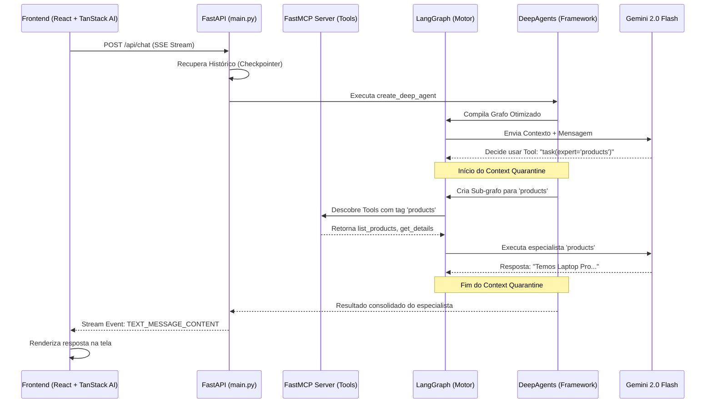

# 🌊 Fluxo Técnico: Do Request à Resposta do Agente

Este documento detalha o ciclo de vida de uma mensagem no sistema, desde o momento em que você clica em "Enviar" no frontend até a renderização da resposta final.

## 🗺️ Visão Geral do Fluxo (Mermaid)

---

## 🛠️ Detalhamento Passo a Passo

### 1. Iniciação e Handshake (FastAPI)
Quando o usuário envia uma mensagem, o frontend abre uma conexão de streaming com o endpoint `/api/chat`.
- **Lifespan**: O FastAPI inicializa o servidor `FastMCP` localmente.
- **Dependency Injection**: O objeto `mcp_server` é passado para o construtor do grafo em `graph.py`.

### 2. Orquestração com DeepAgents
Em vez de um grafo manual complexo, usamos a abstração `create_deep_agent`.
- **Supervisor**: O LLM principal atua como um roteador. Ele tem acesso a uma ferramenta especial chamada `task()`.
- **Roteamento Semântico**: Se o usuário pergunta sobre preços, o Supervisor sabe (via `EXPERTS_METADATA`) que deve delegar para o especialista de `products`.

### 3. Context Quarantine (A "Quarentena")
Este é o coração da nossa arquitetura para evitar poluição de contexto.
- Quando o Supervisor chama o especialista de produtos, o **DeepAgents** cria uma "bolha" de execução.
- O especialista de produtos executa suas próprias ferramentas (consultas ao banco, filtros, etc.).
- **O segredo**: O Supervisor **não vê** as 10 chamadas de ferramentas técnicas que o especialista fez. Ele recebe apenas o resumo final: *"Temos o Laptop Pro por R$ 1.200"*. Isso economiza milhares de tokens e evita alucinações.

### 4. Descoberta Dinâmica de Tools (MCP)
Em vez de registrar ferramentas manualmente em cada agente:
- O `mcp_client.py` varre o `mcp_server` local.
- Ele filtra as ferramentas baseando-se nas **tags** (ex: ferramentas marcadas com `products` vão apenas para o agente de produtos).
- Isso permite que você adicione novas rotas de API e elas apareçam automaticamente para o agente correto.

### 5. Streaming e Protocolo TanStack AI
A comunicação de volta para o frontend segue o padrão **Vercel AI SDK / TanStack**:
- **TEXT_MESSAGE_CONTENT**: Deltas de texto que criam o efeito "máquina de escrever".
- **TOOL_CALL_START / END**: Eventos que dizem ao frontend para mostrar um Spinner ou um Card de aprovação.
- **Context Isolation**: O frontend recebe apenas os eventos que importam para o usuário, escondendo a "cozinha" técnica dos sub-agentes.

## 🔐 Segurança e Persistência
- **Checkpointer (SQLite)**: Cada interação é salva em um banco de dados local. Se o servidor reiniciar, o agente "lembra" de onde parou.
- **HITL (Human-In-The-Loop)**: Se uma ferramenta exigir aprovação (como "Deletar Produto"), o grafo entra em estado de `interrupt()`. O backend para a execução e aguarda um sinal do frontend para continuar.

---

> [!TIP]
> Este fluxo foi desenhado para ser **extensível**. Para adicionar um novo domínio (ex: "Financeiro"), basta criar as ferramentas no MCP com a tag `finance` e atualizar o `EXPERTS_METADATA`. O sistema cuidará do resto automaticamente.
